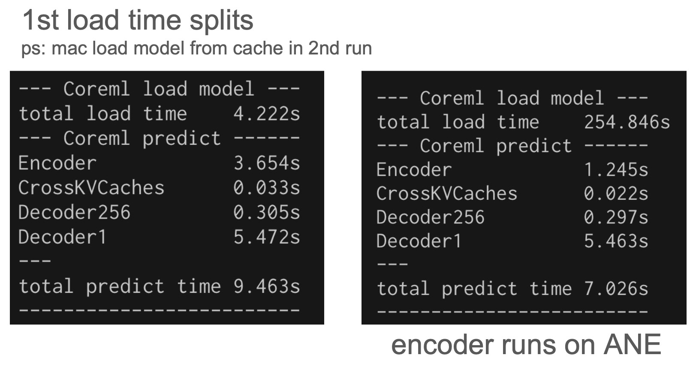

# Whisper+Coreml
Whisper+Coreml speeds up decoder and encoder by using Apple Neural Engine (ANE).
A fork from [openai/whisper](https://github.com/openai/whisper) repo with coreml computing backend

### Usage
```sh
# 1. convert encoder, decoder to coreml model and build shared library
#    ex: turbo model with beam_size=5, conversion will take about 100s
./convert_coreml.sh turbo 5

# 2. transcribe
python -m whisper YOUR_WAV_FILE --language=[ja|en|...] --model=turbo --beam_size=beam_size --best_of=beam_size --word_timestamps=True --use_coreml=True

# Known constraints:
# 1. beam_size and best_of are fixed on each built coreml model
# 2. specifying --language is required
```

### Performance
* transcribe() 1 mins song on Macbook M1 Air 16GB with **beam_size=5** (default option of openai/whisper)


|  Model Size  | 1st load time | cached load time | transcribe time(bs=1) | transcribe time (bs=5)|
|:------|----------:|------------------:|------------------:|------------------:|
| turbo (openai/whisper cpu)  |     |          |21s  |      31s       |
| turbo (whisper+coreml **default**) |  12s   |    1.2s        |load time + 5.5s|load time + 9.5s|
| turbo (whisper+coreml **encoder on ane**)  |4m14s|1.5s| load time + **3.1s**|load time + **7.2s**       |
| turbo ([mlx framework](https://github.com/ml-explore/mlx-examples/tree/main/whisper))| | | 4.6s| not support|

### Notes

* Transcribe time refers to the time taken by transcribe() in transcribe.py. The Python model load time is not included.
* turbo model default:
  * encoder on GPU
  * crossKVCaches on ANE
  * decoder 256 on ANE
  * decoder1 on GPU
* turbo model with encoder on ANE: The encoder runs 3× faster, but there is a 4-minute uncached load time penalty. (Modify coreml/coreml.mm to switch between GPU and ANE mode.)



### About ANE slow uncached load issue
Apple's ANECompilerService is slow for large models. It compiles the model on each user’s device. This cannot be avoided when choosing the Neural Engine as the compute unit. It cannot compile small models in parallel. The only workaround is to divide the encoder into smaller encoders to speed it up a little. That's why I choose the GPU as the encoder's compute unit by default.

* Experiments on ANECompilerService uncached load time:
  * one big turbo encoder: 610 secs
  * 3 small encoders: 250s (default)
  * 8 small encoders: 170s
  * 16 smaller encoders: 154s

If you use whisper on Mac, I highly recommend you use [MLX framework from Apple](https://github.com/ml-explore/mlx-examples/tree/main/whisper) instead of **coreml**. With MLX framework, no need to wait for the slow ANECompilerService. Happy developer and user experience. (PS: some limits on mlx framework are fixed beam size to 1 and slower when **--word-timestamps=True**)
